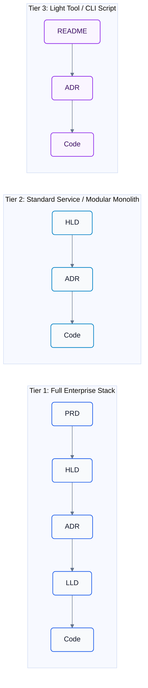
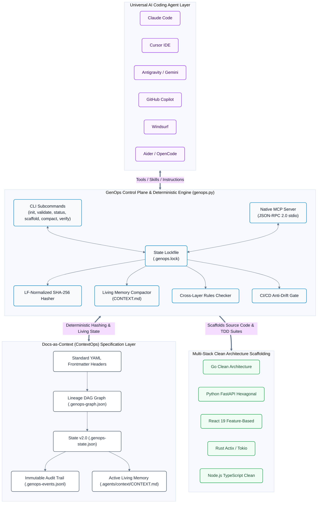

# GenOps — Agent-Native Specification Pipeline & Governance Engine

[](https://github.com/seismael/genops/actions)
[](https://opensource.org/licenses/MIT)
[](https://www.python.org/)
[](#)
[](#current-state--maturity-level)

> **Declarative. Cascading. Executable. Socratic. 100% Agent-Native.**

GenOps is an agent-native cognitive operating system and deterministic specification pipeline implementing the **Docs-as-Context (ContextOps)** paradigm. It decomposes complex software and research initiatives into isolated, cascading specification stages governed by Socratic elicitation, cryptographic LF-normalized SHA-256 state tracking, living memory compaction (`CONTEXT.md`), and automated CI/CD anti-drift gates.

```mermaid
%%{init: {'theme': 'base', 'themeVariables': { 'fontFamily': 'Inter, system-ui, sans-serif', 'lineColor': '#64748b', 'primaryTextColor': '#0f172a' }}}%%
flowchart LR
    subgraph P1 ["1. Requirements"]
        direction TB
        CMD_PRD["/genops-prd<br/><b>Principal PM</b>"]
        DOC_PRD[("docs/prd/<br/>PRD-*.md")]
        CMD_PRD --> DOC_PRD
    end

    subgraph P2 ["2. High-Level Design"]
        direction TB
        CMD_HLD["/genops-hld<br/><b>Principal Architect</b>"]
        DOC_HLD[("docs/hld/<br/>HLD-*.md")]
        CMD_HLD --> DOC_HLD
    end

    subgraph P3 ["3. Architecture Decisions"]
        direction TB
        CMD_ADR["/genops-adr<br/><b>Staff Systems Engineer</b>"]
        DOC_ADR[("docs/architecture/<br/>ADR-*.md")]
        CMD_ADR --> DOC_ADR
    end

    subgraph P4 ["4. Low-Level Design"]
        direction TB
        CMD_LLD["/genops-lld<br/><b>Lead Engineer</b>"]
        DOC_LLD[("docs/lld/<br/>LLD-*.md")]
        CMD_LLD --> DOC_LLD
    end

    subgraph P5 ["5. Implementation"]
        direction TB
        CMD_CODE["/genops-code<br/><b>Principal SWE</b>"]
        OUT_SRC[("src/<br/>Clean Architecture & TDD")]
        CMD_CODE --> OUT_SRC
    end

    DOC_PRD ==>|"Cascade"| CMD_HLD
    DOC_HLD ==>|"Cascade"| CMD_ADR
    DOC_ADR ==>|"Cascade"| CMD_LLD
    DOC_LLD ==>|"Scaffold"| CMD_CODE

    classDef stageNode fill:#f8fafc,stroke:#2563eb,stroke-width:1.5px,color:#0f172a,rx:8px,ry:8px;
    classDef docNode fill:#ffffff,stroke:#64748b,stroke-width:1px,color:#334155,rx:6px,ry:6px;
    classDef codeNode fill:#f0fdf4,stroke:#16a34a,stroke-width:1.5px,color:#14532d,rx:8px,ry:8px;
    
    class CMD_PRD,CMD_HLD,CMD_ADR,CMD_LLD stageNode;
    class DOC_PRD,DOC_HLD,DOC_ADR,DOC_LLD docNode;
    class CMD_CODE,OUT_SRC codeNode;
```



---

## Current State & Maturity Level

GenOps has achieved the **v3.0 Super Skills** milestone:

| Capability Vector | Baseline (v2.0) | Current State (v3.0 Super Skills) | Operational Value |
|---|---|---|---|
| **Elicitation Model** | Static question checklist | Socratic Challenger (probes NFRs, challenges premature complexity) | Eliminates architectural errors before drafting |
| **Review Process** | Human approval gate only | Dual-Pass: Simulated Staff Critic (STRIDE/Resilience/Observability) + `<HARD-GATE>` | Catches failure modes and security vulnerabilities early |
| **Specification Format** | Markdown tables & narrative text | Machine-executable OpenAPI 3.1 YAML, PostgreSQL 16+ DDL, Go/Python Ports | Zero-ambiguity contracts ready for compiler generation |
| **Scaffolding Depth** | Empty struct stubs with IDs | Hexagonal / Clean Architecture (`domain/`, `ports/`, `adapters/`, `handlers/`, `tests/`) | Production-ready, decoupled polyglot baselines |
| **Verification Loop** | Regex table drift checks | Compiler-in-the-loop diagnostics (`genops verify`) + CI anti-drift gate | Guarantees code compiles with 0 warnings |
| **Living Context** | Static markdown placeholder | Active Living Memory Compactor (`ContextCompactor` $\to$ `CONTEXT.md`) | Prevents LLM context saturation and drift |
| **Runtime Dependencies** | Standalone script | Zero external `pip` dependencies (pure Python 3.8+ stdlib) | 100% portable, agent-native, in-repo execution |

---

## 100% Technology & Architecture Agnosticism

GenOps does **not** force any language, runtime, or macro-architecture. It adapts across project scales via its built-in architecture spectrum (defined in [RFC-001](docs/architecture/RFC-001-contextops-architecture.md)):



- **Any Architectural Pattern:** Single-file script, CLI utility, Modular Monolith, Event-Driven microservices, CQRS/Event Sourcing, or Serverless.
- **Any Programming Language:** Go, Rust, Python, TypeScript/Node, React 19, Java, C++, Zig, Elixir, or custom in-house enterprise stacks via declarative `.agents/scaffolds/<stack>/STRUCTURE.yaml`.

---

## The Recursive Socratic Feedback Loop

At every stage, the agent operates as a specialized thinking partner:

```
  [1. INQUIRE] ─────► [2. CHALLENGE] ─────► [3. CAPTURE NOTES]
       ▲                                            │
       │                                            ▼
  [6. REFINE]  ◄───── [5. USER FEEDBACK] ◄───── [4. DRAFT & PRESENT]
                             │
                             ▼ (When Approved)
                      [7. LOCK & RECORD] ──► [8. CASCADE DOWNSTREAM]
```

1. **Inquire:** Asks template questions one at a time (no questionnaire dumps).
2. **Challenge (Socratic Challenger):** Probes assumptions, challenges premature complexity, and demands numeric SLOs.
3. **Capture Notes:** Gathers non-negotiables, glossaries, and technology choices into `CONTEXT.md`.
4. **Draft & Present:** Generates executable specifications with YAML frontmatter headers and previews downstream impact.
5. **User Feedback & Refine:** Applies iterative delta adjustments per user direction.
6. **Lock & Record:** Updates `docs/.genops-state.json` (v2.0) with atomic lock protection, appends immutable audit events, and marks downstream layers for cascading re-generation if upstream inputs change.

---

## Tri-Layer System Architecture



---

## Quick Start

```bash
git clone https://github.com/seismael/genops.git my-project
cd my-project
```

Initialize across all coding agent platforms in your repository:

```bash
# Synchronize all agent entrypoints (AGENTS.md, CLAUDE.md, Cursor rules, Copilot, Windsurf, Aider)
python .agents/scripts/genops.py init --agent all
```

Execute the specification pipeline:

```bash
/genops-prd            # 1. Requirements (Principal PM)
/genops-hld            # 2. System Topology (Principal Architect)
/genops-adr            # 3. Tech Trade-offs (Staff Systems Engineer)
/genops-lld            # 4. Detailed Contracts & Scaffolding Blueprint (Lead Engineer)
/genops-code           # 5. Clean Architecture & TDD Suite Scaffolding (Principal SWE)
```

---

## Pipeline Presets

GenOps supports multiple domain-specific pipelines out of the box:

```bash
# Software Specification Pipeline (Default)
python .agents/scripts/genops.py init --preset software-spec

# Systematic Research Pipeline (PRISMA Reviews, Formal Hypotheses, Empirical Reports)
python .agents/scripts/genops.py init --preset research

# Strategic Design Pipeline (WCAG Briefs, Wireframes, Design Tokens, Prototypes)
python .agents/scripts/genops.py init --preset design
```

---

## Model Context Protocol (MCP) Integration

Any agent environment supporting MCP can run GenOps natively over `stdio`:

```json
{
  "mcpServers": {
    "genops": {
      "command": "python",
      "args": [".agents/scripts/genops.py", "mcp"]
    }
  }
}
```

Exposed MCP tools:
- `genops_validate`: Validates configuration, presets, templates, and scaffolds.
- `genops_status`: Retrieves live pipeline health and staleness graph.
- `genops_hash`: Computes cross-platform LF-normalized SHA-256 hashes.
- `genops_record`: Atomically records stage state with lockfile safety and triggers memory compaction.
- `genops_compact`: Synthesizes living project memory into `.agents/context/CONTEXT.md`.
- `genops_verify`: Executes compiler and linter diagnostics across polyglot source workspace.
- `genops_scaffold`: Expands LLD module stubs and templates into `src/`.
- `genops_graph`: Generates specification lineage graph and DAG visualization.
- `genops_drift`: Runs CI/CD anti-drift check between LLD specs and source code.
- `genops_check_rules`: Enforces cross-layer semantic validation rules.
- `genops_rtm`: Generates bidirectional Requirements Traceability Matrix.
- `genops_context`: Slices the DAG for domain-targeted prompt loading.
- `genops_report`: Generates executive self-contained HTML dashboard.
- `genops_ingest`: Reverse-engineers legacy un-architected codebases into baseline LLD specifications.

---

## Clean Architecture Polyglot Scaffolds

`/genops-code` expands production-grade Clean / Hexagonal Architecture folders in `src/`:

```
src/{module}/
├── cmd/
│   └── main.go                    # Application bootstrap & DI wireup
├── internal/
│   ├── domain/                    # Pure business logic & invariant validation
│   ├── ports/                     # Primary & Secondary interface definitions
│   ├── service/                   # Application use-case orchestrators
│   ├── adapters/                  # Secondary infrastructure (Postgres, Redis)
│   └── handlers/                  # Primary ingress adapters (REST, gRPC)
└── tests/
    └── contract/                  # OpenAPI / Contract test fixtures
```

Available built-in scaffolds (`.agents/scaffolds/`):
- `go-service`: Hexagonal Go microservice (Gin/pgx/testify).
- `python-fastapi`: Async Python Clean Service (FastAPI/Pydantic v2/SQLAlchemy).
- `react-vite`: React 19 SPA with feature-based architecture and Tailwind design tokens.
- `rust-service`: Asynchronous Rust microservice (Actix Web/Tokio/Serde).
- `node-service`: TypeScript microservice (Express/Zod/Vitest).
- `go-library`: Reusable Go domain package.

---

## Command-Line Reference

| Command | Description |
|---|---|
| `python .agents/scripts/genops.py init [--preset <p>] [--agent <a>]` | Initialize GenOps across agent entrypoint files |
| `python .agents/scripts/genops.py validate` | Validate genops.yaml, presets, templates, and scaffolds |
| `python .agents/scripts/genops.py status` | Display pipeline health and cryptographic staleness status |
| `python .agents/scripts/genops.py hash <path>` | Compute LF-normalized SHA-256 hash for file or directory |
| `python .agents/scripts/genops.py record <stage> [--actor <a>]` | Atomically record stage approval into state v2.0 |
| `python .agents/scripts/genops.py scaffold --module <m> --scaffold <s>` | Expand scaffold templates and entity stubs into `src/` |
| `python .agents/scripts/genops.py compact` | Compact active living project memory into `CONTEXT.md` |
| `python .agents/scripts/genops.py verify` | Run compiler & linter diagnostics across source workspace |
| `python .agents/scripts/genops.py drift` | CI/CD anti-drift check asserting 100% LLD-to-code sync |
| `python .agents/scripts/genops.py rtm` | Generate bidirectional Requirements Traceability Matrix |
| `python .agents/scripts/genops.py graph` | Generate specification lineage DAG (`.genops-graph.json`) |
| `python .agents/scripts/genops.py check-rules` | Verify cross-layer semantic validation rules |
| `python .agents/scripts/genops.py context --domain <slug>` | Extract targeted upstream DAG slice for token efficiency |
| `python .agents/scripts/genops.py report [--html <path>]` | Generate self-contained executive HTML dashboard |
| `python .agents/scripts/genops.py ingest [--src <path>]` | Brownfield legacy codebase reverse-engineering |
| `python .agents/scripts/genops.py mcp` | Start JSON-RPC 2.0 stdio Model Context Protocol server |

---

## Use Cases & Documentation

- [User Experience, Real-World Use Cases & Workflows Guide](docs/guides/USE_CASES_AND_WORKFLOWS.md) — Walkthroughs for Greenfield, Incremental Features, Database Migrations, Brownfield Ingestion, and SOC2 Audits.
- [RFC-001: ContextOps Architecture Whitepaper](docs/architecture/RFC-001-contextops-architecture.md) — Mathematical and architectural foundations of the Docs-as-Context paradigm.

---

## Requirements

- Any AI coding agent (Claude Code, Cursor, Antigravity, GitHub Copilot, Windsurf, OpenCode, Aider)
- Python 3.8+ (standard library only, zero external pip dependencies)

## License

MIT — see [LICENSE](LICENSE).
