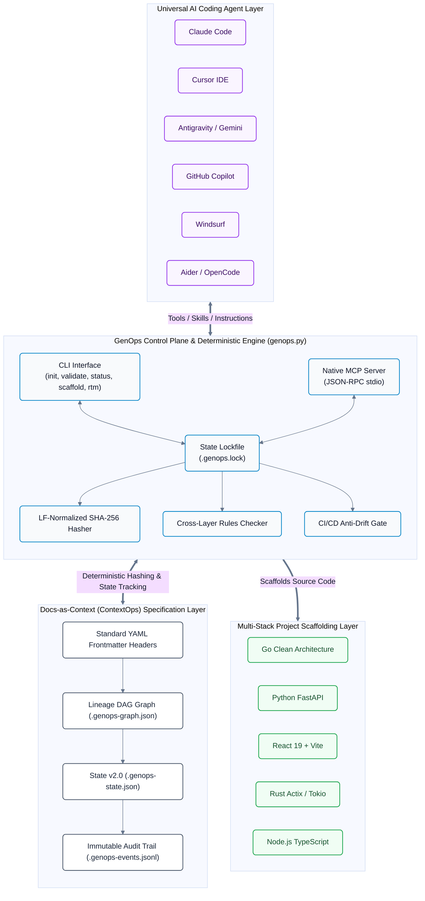
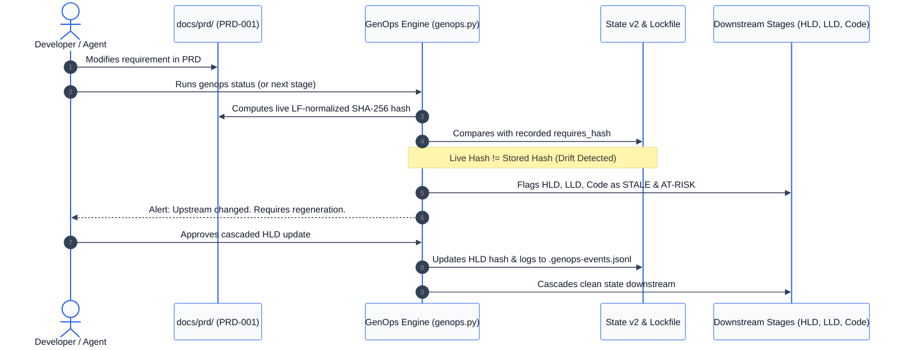

# GenOps — Agent-Native Specification Pipeline

**Declarative. Cascading. Agent-First.**

GenOps is a separation-of-concerns pipeline engine that decomposes complex software work into isolated, cascading specification stages. Each stage is a native agent skill backed by a deterministic, zero-dependency engine (`.agents/scripts/genops.py`) and a Model Context Protocol (MCP) server.

```mermaid
%%{init: {'theme': 'base', 'themeVariables': { 'fontFamily': 'Inter, system-ui, sans-serif', 'lineColor': '#64748b', 'primaryTextColor': '#0f172a' }}}%%
flowchart LR
    subgraph P1 ["1. Requirements"]
        direction TB
        CMD_PRD["/genops-prd<br/><b>Product Vision & Scope</b>"]
        DOC_PRD[("docs/prd/<br/>PRD-*.md")]
        CMD_PRD --> DOC_PRD
    end

    subgraph P2 ["2. High-Level Design"]
        direction TB
        CMD_HLD["/genops-hld<br/><b>System Topology & NFRs</b>"]
        DOC_HLD[("docs/hld/<br/>HLD-*.md")]
        CMD_HLD --> DOC_HLD
    end

    subgraph P3 ["3. Architecture Decisions"]
        direction TB
        CMD_ADR["/genops-adr<br/><b>Tech Stack & Trade-offs</b>"]
        DOC_ADR[("docs/architecture/<br/>ADR-*.md")]
        CMD_ADR --> DOC_ADR
    end

    subgraph P4 ["4. Low-Level Design"]
        direction TB
        CMD_LLD["/genops-lld<br/><b>Schemas & Contracts</b>"]
        DOC_LLD[("docs/lld/<br/>LLD-*.md")]
        CMD_LLD --> DOC_LLD
    end

    subgraph P5 ["5. Implementation"]
        direction TB
        CMD_CODE["/genops-code<br/><b>Deterministic Scaffolder</b>"]
        OUT_SRC[("src/<br/>Source Code & Tests")]
        CMD_CODE --> OUT_SRC
    end

    DOC_PRD ==>|"Cascade"| CMD_HLD
    DOC_HLD ==>|"Cascade"| CMD_ADR
    DOC_ADR ==>|"Cascade"| CMD_LLD
    DOC_LLD ==>|"Scaffold"| CMD_CODE

    classDef stageNode fill:#f8fafc,stroke:#2563eb,stroke-width:1.5px,color:#0f172a,rx:8px,ry:8px;
    classDef docNode fill:#ffffff,stroke:#64748b,stroke-width:1px,color:#334155,rx:6px,ry:6px;
    classDef codeNode fill:#f0fdf4,stroke:#16a34a,stroke-width:1.5px,color:#14532d,rx:8px,ry:8px;
    
    class CMD_PRD,CMD_HLD,CMD_ADR,CMD_LLD stageNode;
    class DOC_PRD,DOC_HLD,DOC_ADR,DOC_LLD docNode;
    class CMD_CODE,OUT_SRC codeNode;
```



The terminal stage (`/genops-code`) reads LLD's project structure and scaffolds actual source files using predefined scaffold templates — not documentation about code, but the code itself.

---

## Why GenOps

AI coding agents are powerful but unfocused. They skip planning, mix concerns, and lose context across long sessions. GenOps enforces structure:

- **One stage at a time** — SoC by design. Each stage handles exactly one layer.
- **Reactive cascading** — Change an upstream doc and all downstream layers detect staleness with per-file precision.
- **100% Agent-Agnostic & Native** — Out-of-the-box support for Claude Code, Cursor, Antigravity, GitHub Copilot, Windsurf, OpenCode, Aider, and Gemini.
- **Template-driven with YAML Frontmatter** — Every design doc includes machine-readable metadata headers for deterministic indexing and graph traversal.
- **Multi-Stack Scaffolding** — `/genops-code` generates actual project files from LLD design across Go, Python, TypeScript/Node, React, and Rust with multi-casing transforms.
- **Model Context Protocol (MCP) Server** — Native tool-calling integration for any MCP-compatible environment.
- **Automated Anti-Drift & Traceability** — Built-in CI/CD drift gate and Requirements Traceability Matrix (RTM) generator.

---

## Architecture & System Topology



---

## Reactive Staleness Cascade Engine

When an upstream requirement or design changes, GenOps uses LF-normalized cryptographic hashing to instantly identify affected downstream layers:



---

## Quick Start

```bash
git clone https://github.com/seismael/genops.git my-project
cd my-project
```

Initialize across all coding agent platforms:

```bash
# Sync all agent instruction files (AGENTS.md, CLAUDE.md, Cursor rules, Copilot, Windsurf, Aider)
python .agents/scripts/genops.py init --agent all
```

Execute the pipeline:

```bash
/genops-prd            # Define product requirements
/genops-hld            # Design system architecture
/genops-adr            # Document architectural decisions
/genops-lld            # Specify low-level design (includes project structure)
/genops-code           # Scaffold actual project from LLD → src/
```

---

## Universal Agent Compatibility

GenOps is 100% agent-agnostic and supports multiple integration modalities:

| Agent / Platform | Integration Entrypoint | Setup Command |
|---|---|---|
| **Antigravity / Gemini CLI** | `AGENTS.md` / `GEMINI.md` | `python .agents/scripts/genops.py init --agent antigravity` |
| **Anthropic Claude Code CLI** | `CLAUDE.md` | `python .agents/scripts/genops.py init --agent claude` |
| **Cursor IDE** | `.cursor/rules/genops.mdc` / `.cursorrules` | `python .agents/scripts/genops.py init --agent cursor` |
| **GitHub Copilot** | `.github/copilot-instructions.md` | `python .agents/scripts/genops.py init --agent copilot` |
| **Windsurf Cascade** | `.windsurfrules` | `python .agents/scripts/genops.py init --agent windsurf` |
| **Aider / OpenCode** | `CONVENTIONS.md` | `python .agents/scripts/genops.py init --agent all` |
| **MCP Tool-Calling (Any IDE)** | `.agents/mcp.json` (`genops mcp`) | Add `.agents/mcp.json` to IDE MCP settings |

### Model Context Protocol (MCP) Integration

Any agent environment supporting MCP can expose GenOps tools directly:

```json
{
  "mcpServers": {
    "genops": {
      "command": "python",
      "args": [".agents/scripts/genops.py", "mcp"]
    }
  }
}
```

Exposed MCP tools:
- `genops_validate`: Validates configuration, presets, templates, and scaffolds.
- `genops_status`: Retrieves live pipeline health and staleness graph.
- `genops_hash`: Computes cross-platform LF-normalized SHA-256 hashes.
- `genops_record`: Atomically records stage state with lockfile safety.
- `genops_scaffold`: Expands LLD module stubs and templates into `src/`.
- `genops_graph`: Generates specification lineage graph and DAG visualization.
- `genops_drift`: Runs CI/CD anti-drift check between LLD specs and source code.
- `genops_check_rules`: Enforces cross-layer semantic validation rules.
- `genops_rtm`: Generates bidirectional Requirements Traceability Matrix.
- `genops_context`: Slices the DAG for domain-targeted prompt loading.
- `genops_report`: Generates executive self-contained HTML dashboard.

---

## Commands

| Command | Scope | Description |
|---------|-------|-------------|
| `/genops-prd` | Product Requirements | Define vision, user stories, success metrics, scope |
| `/genops-hld` | High-Level Design | Architecture topology, components, data flow, NFRs |
| `/genops-adr` | Architecture Decisions | Trade-off analysis, technology selection (incremental) |
| `/genops-lld` | Low-Level Design | Entities, schemas, API contracts, **project structure** |
| `/genops-code` | Implementation | Scaffold project from LLD using scaffold templates |
| `/genops` | Pipeline Engine | Orchestrate pipeline, check status, start from any stage |
| `/genops-init` | Initializer | Initialize GenOps across agent entrypoint files |
| `/genops-status` | Dashboard | Pipeline health report with per-file stale detection |

---

## Flow Modes

| Mode | Invocation | Behavior |
|------|-----------|----------|
| **SoC** (default) | `/genops-prd` | One stage at a time. After approval, ask: "Next or save for later?" |
| **Targeted** | `/genops-prd --domain <slug>` | Scopes execution or modification exclusively to specified domain |
| **Flow** | `/genops-prd --flow` | Complete stage, then auto-invoke the next (one-hop cascade) |
| **Nonstop** | `/genops-prd --nonstop` | Run the full pipeline with approval gates at each stage |
| **Incremental** | `/genops --from adr --domain <slug>` | Incremental cascade for single domain |
| **Status** | `/genops --status` | Shows live pipeline health and stale downstream flags |

For detailed real-world scenarios (Greenfield, Incremental Features, Database Migrations, Compliance Certification), see the [User Experience & Use Cases Guide](docs/guides/USE_CASES_AND_WORKFLOWS.md).

---

## Document Organization

Design documents use domain-split naming: `{STAGE}-{NNN}-{descriptive-slug}.md` with standardized YAML frontmatter headers.

```
docs/
├── prd/
│   ├── PRD-001-product-catalog.md       # Single domain = 1 file
│   └── PRD-002-shopping-cart.md         # Multi-domain = N files
├── hld/
│   ├── HLD-001-system-topology.md
│   └── HLD-002-catalog-service.md
├── architecture/
│   ├── ADR-001-go-language.md           # One per decision
│   └── ADR-002-sqlite-storage.md
├── lld/
│   ├── LLD-001-catalog-schema.md        # Defines project structure
│   └── LLD-002-payment-contracts.md
├── .genops-state.json                   # State v2.0 per-file LF-hash tracking
└── .genops-events.jsonl                 # Append-only immutable audit trail
```

---

## Project Output & Scaffolds

`/genops-code` reads LLD's `## Project Structure` and scaffolds real source files:

```
src/
├── services/
│   ├── user-service/             # Scaffold: go-service
│   ├── auth-service/             # Scaffold: rust-service
│   ├── api-gateway/              # Scaffold: node-service
│   └── triage-service/           # Scaffold: python-fastapi
├── web/                          # Scaffold: react-vite
├── docker-compose.yml
└── README.md
```

Available built-in scaffolds (`.agents/scaffolds/`):
- `go-service`: Clean Architecture Go microservice.
- `python-fastapi`: Modern async Python REST API with Pydantic.
- `react-vite`: React TypeScript SPA with Tailwind tokens.
- `rust-service`: High-throughput asynchronous Rust microservice (Actix Web / Tokio).
- `node-service`: Node.js TypeScript backend service (Express / Vitest).
- `go-library`: Reusable Go domain package.

---

## Architecture Whitepaper

For the formal mathematical and structural specification of the Docs-as-Context (ContextOps) paradigm, see [RFC-001: ContextOps Architecture](docs/architecture/RFC-001-contextops-architecture.md).

---

## Requirements

- Any AI coding agent (Claude Code, Cursor, Antigravity, GitHub Copilot, Windsurf, OpenCode, Aider)
- Python 3.8+ (standard library only, zero external pip dependencies)

## License

MIT — see [LICENSE](LICENSE).

## Contributing

See [CONTRIBUTING.md](CONTRIBUTING.md).
