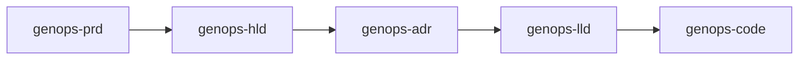

# GenOps

Agent-native specification pipeline and governance engine. GenOps decomposes
software, research, and design work into isolated, cascading specification stages,
each backed by a deterministic CLI engine with cryptographic state tracking.

- **Zero external dependencies** — pure Python 3.8+ standard library.
- **Agent-native** — driven through slash-command skills and a native MCP server.
- **Deterministic** — LF-normalized SHA-256 state, atomic lockfile, immutable audit trail.
- **Versioned in-repo** — the engine lives in `.agents/` and is versioned with the project it governs.



---

## Pipelines

Three declarative presets (`genops.yaml`) ship out of the box. Each stage generates
a modular document with YAML frontmatter into its own `docs/` directory.

| Preset | Stages |
|---|---|
| `software-spec` (default) | `prd` → `hld` → `adr` → `lld` → `code` |
| `research` | `lit-review` → `hypothesis` → `experiment` → `report` |
| `design` | `brief` → `wireframes` → `mockups` → `prototype` |

A stage `next` defines the cascade; `requires`/`outputs` drive deterministic
staleness propagation — an upstream change marks every downstream stage stale.

---

## Quick Start

**Template (recommended):** click **"Use this template"** on GitHub, then clone.

**Or clone directly:**

```bash
git clone https://github.com/seismael/GenOps.git my-project
cd my-project
```

Initialize the pipeline and agent entrypoints (idempotent):

```bash
python .agents/scripts/genops.py init --preset software-spec --agent all
```

Verify health, then drive the pipeline from your agent:

```bash
python .agents/scripts/genops.py doctor
```

---

## Agent Integration

GenOps surfaces in three ways:

1. **Slash-command skills** — `.agents/skills/genops-*/SKILL.md` (17 skills) covering
   every stage of all three pipelines plus the engine/init/status orchestrators.
2. **Native MCP server** — a JSON-RPC 2.0 stdio server exposing 15 tools
   (`genops_validate`, `genops_status`, `genops_scaffold`, …).
3. **CLI engine** — `.agents/scripts/genops.py` with 19 subcommands.

### Global install (all coding agents)

```bash
python .agents/scripts/install_global.py
```

This bundles the engine into `~/.genops/`, writes a **self-healing launcher**
(`~/.genops/bin/genops`) that re-resolves a working Python interpreter on every
launch, and registers the `genops` MCP server for every detected agent
(Gemini/Antigravity, Claude Code, OpenCode, Cline). No interpreter path is baked,
so removing or upgrading Python never breaks the MCP server.

### MCP tools

| Tool | Description |
|---|---|
| `genops_validate` | Validate config, presets, templates, and scaffolds |
| `genops_status` | Pipeline health and staleness graph |
| `genops_impact` | Change-impact blast radius across downstream specs/modules |
| `genops_hash` | LF-normalized SHA-256 hash of a file or directory |
| `genops_record` | Atomically record stage approval into state v2 |
| `genops_compact` | Compact living memory into `CONTEXT.md` |
| `genops_verify` | Compiler/linter diagnostics across the source workspace |
| `genops_scaffold` | Expand a module from a scaffold template into `src/` |
| `genops_graph` | Generate the specification lineage DAG |
| `genops_drift` | Anti-drift check between LLD specs and source |
| `genops_check_rules` | Cross-layer semantic validation rules |
| `genops_rtm` | Requirements Traceability Matrix |
| `genops_context` | Domain-targeted DAG slice for prompt loading |
| `genops_report` | Self-contained executive HTML dashboard |
| `genops_ingest` | Reverse-engineer a legacy codebase into baseline LLD |

---

## Command-Line Reference

| Command | Description |
|---|---|
| `genops init [--preset <p>] [--agent <a>]` | Initialize GenOps across agent entrypoints |
| `genops validate` | Validate config, presets, templates, scaffolds |
| `genops doctor` | Run all governance gates (validate, check-rules, drift, verify) |
| `genops demo [--scaffold <s>] [--module <m>]` | Scaffold a throwaway module and verify it end-to-end |
| `genops status` | Pipeline health and cryptographic staleness |
| `genops impact <spec>` | Simulate change impact |
| `genops hash <path>` | LF-normalized SHA-256 hash |
| `genops record <stage> [--actor <a>]` | Record stage approval into state v2 |
| `genops scaffold --module <m> --scaffold <s> [--entities <e>]` | Expand scaffold into `src/` |
| `genops compact` | Compact living memory into `CONTEXT.md` |
| `genops verify` | Compiler/linter diagnostics |
| `genops drift` | Anti-drift gate (LLD ↔ source) |
| `genops rtm` | Requirements Traceability Matrix |
| `genops graph` | Lineage DAG (`.genops-graph.json`) |
| `genops check-rules` | Cross-layer semantic rules |
| `genops context --domain <slug>` | Targeted upstream DAG slice |
| `genops report [--html <path>]` | Executive HTML dashboard |
| `genops ingest [--src <path>]` | Brownfield reverse-engineering |
| `genops mcp` | Start the MCP stdio server |
| `genops --version` | Print the engine version |

---

## Scaffolds

`genops-code` (or `genops scaffold`) expands Clean/Hexagonal Architecture into
`src/{module}/` from `.agents/scaffolds/`:

| Scaffold | Stack |
|---|---|
| `go-service` | Hexagonal Go microservice |
| `python-fastapi` | Async FastAPI clean service |
| `react-vite` | React 19 feature-based SPA |
| `rust-service` | Async Rust microservice (Actix/Tokio) |
| `node-service` | TypeScript microservice (Express/Zod) |
| `go-library` | Reusable Go domain package |

---

## Examples

| Example | Stack | Demonstrates |
|---|---|---|
| [`examples/url-shortener`](examples/url-shortener) | Python · FastAPI · SQLite | Hexagonal architecture, SSRF-hardened domain, API-key auth, click analytics |
| [`examples/url-shortener-cluster`](examples/url-shortener-cluster) | Go microservices | Distributed Redis/Kafka/ClickHouse design with mocked adapters |

---

## Documentation

- [Distribution](docs/DISTRIBUTION.md) — how to obtain GenOps, publish a release, and install globally.
- [RFC-001: ContextOps Architecture](docs/architecture/RFC-001-contextops-architecture.md) — architectural foundations.
- [Use Cases & Workflows](docs/guides/USE_CASES_AND_WORKFLOWS.md) — greenfield, incremental, migration, and brownfield walkthroughs.
- [Changelog](CHANGELOG.md) — release history.

---

## Requirements

- Any AI coding agent (Claude Code, Cursor, Gemini/Antigravity, Copilot, Windsurf, OpenCode, Aider)
- Python 3.8+ (standard library only)

## License

MIT — see [LICENSE](LICENSE).
