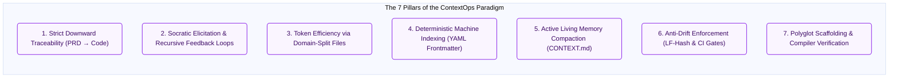
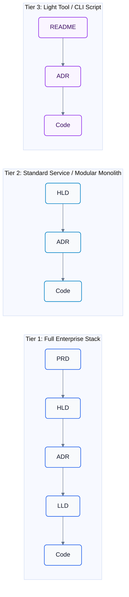

# RFC-001: ContextOps Architecture & Specification Pipeline

## 1. Executive Summary

Modern AI coding agents fail predominantly due to **monolithic prompt collapse**, **context pollution**, and **architectural drift**. When an agent is tasked with implementing a large feature end-to-end in a single prompt, it mixes business requirements, system topology, technology trade-offs, database schemas, and implementation details into an unverified, hallucination-prone output.

**GenOps** formalizes the **Docs-as-Context (ContextOps)** paradigm through a cascading, separation-of-concerns (SoC) specification pipeline:

```mermaid
%%{init: {'theme': 'base', 'themeVariables': { 'fontFamily': 'Inter, system-ui, sans-serif', 'lineColor': '#64748b', 'primaryTextColor': '#0f172a' }}}%%
flowchart LR
    PRD["<b>PRD</b><br/>Product Requirements"] -->|"Cascades into"| HLD["<b>HLD</b><br/>System Topology"]
    HLD -->|"Cascades into"| ADR["<b>ADR</b><br/>Tech Decisions"]
    ADR -->|"Cascades into"| LLD["<b>LLD</b><br/>Contracts & Schemas"]
    LLD -->|"Scaffolds into"| CODE["<b>Code</b><br/>Deterministic Source"]

    classDef stageBox fill:#f8fafc,stroke:#2563eb,stroke-width:1.5px,color:#0f172a,rx:6px,ry:6px;
    class PRD,HLD,ADR,LLD,CODE stageBox;
```



Each stage is isolated in scope, produces machine-readable artifacts with YAML frontmatter, and detects upstream changes via LF-normalized SHA-256 hash tracking:

$$\text{State}(\text{Stage}_i) = f\left(\text{Hash}_{\text{LF}}(\text{Requires}(\text{Stage}_i)), \text{Approved}(\text{Stage}_{i-1})\right)$$

---

## 2. The 7 Pillars of ContextOps



| Pillar | Mechanism | Value for Humans & AI Agents |
|---|---|---|
| **1. Strict Traceability** | $PRD \rightarrow HLD \rightarrow ADR \rightarrow LLD \rightarrow Code$ | Establishes a downward dependency chain ensuring every line of code traces directly to verified business intent. |
| **2. Socratic Elicitation** | Inquire $\rightarrow$ Challenge $\rightarrow$ Capture Notes $\rightarrow$ Draft $\rightarrow$ Refine | The agent acts as an architectural thinking partner, challenging premature complexity and probing failure modes. |
| **3. Token Efficiency** | Single-responsibility domain-split files | Prevents context window saturation. Agents load only the specific $4096\text{-byte}$ aligned LLD or ADR relevant to their current task. |
| **4. Machine Indexing** | Standard YAML Frontmatter + JSON Schemas | Replaces fuzzy semantic RAG search with deterministic graph traversal during context retrieval. |
| **5. Living Memory** | Active Context Compaction (`ContextCompactor`) | Auto-synthesizes domain glossaries, accepted ADR choices, and invariants into `.agents/context/CONTEXT.md`. |
| **6. Anti-Drift Enforcement** | Deterministic LF-normalized hashing & CI gates | Blocks builds when source code changes without accompanying spec updates. |
| **7. Polyglot Scaffolding** | Pluggable scaffolds (`STRUCTURE.yaml`) + Compiler check | Expands production-ready Clean Architecture directories and verifies syntax with `genops verify`. |

---

## 3. Technology & Architecture Agnosticism

GenOps is 100% stack-agnostic and architecture-neutral. It supports any style, language, and project scale across three distinct tiers:



---

## 4. The Recursive Socratic Feedback Loop

```
  [1. INQUIRE] ─────► [2. CHALLENGE] ─────► [3. CAPTURE NOTES]
       ▲                                            │
       │                                            ▼
  [6. REFINE]  ◄───── [5. USER FEEDBACK] ◄───── [4. DRAFT & PRESENT]
                             │
                             ▼ (When Approved)
                      [7. LOCK & RECORD] ──► [8. CASCADE DOWNSTREAM]
```

At every stage, the agent operates as a specialized cognitive partner:
- **Inquire:** Asks template questions one at a time.
- **Challenge:** Evaluates trade-offs and probes failure boundaries.
- **Capture Notes:** Gathers non-negotiables into `CONTEXT.md`.
- **Draft & Present:** Previews generated specs and impact map.
- **User Feedback & Refine:** Applies delta modifications until approved.
- **Lock & Record:** Updates state v2.0, appends immutable events, and detects downstream staleness.

---

## 5. Core Non-Negotiables for Agent Workflows

1. **Machine-Readable Metadata (YAML Frontmatter):** Every specification document must include standardized headers (`id`, `domain`, `stage`, `upstream_refs`, `downstream_refs`, `version`, `status`).
2. **ADR-First Technical Decisions:** No architecture or dependency overhaul may proceed without an accepted Architecture Decision Record.
3. **Domain-Split Modular Files:** Specifications must remain domain-scoped (`{STAGE}-{NNN}-{slug}.md`) rather than collapsing into monolithic documents.
4. **Deterministic Hash Tracking:** State transitions must be tracked via LF-normalized SHA-256 hashes to guarantee cross-platform determinism across Windows, macOS, and Linux.
5. **Living Memory Maintenance:** Every stage recording automatically updates `.agents/context/CONTEXT.md` to prevent long-term context decay.
