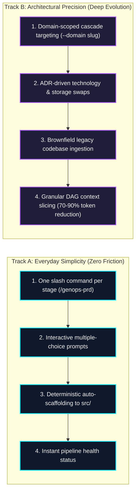
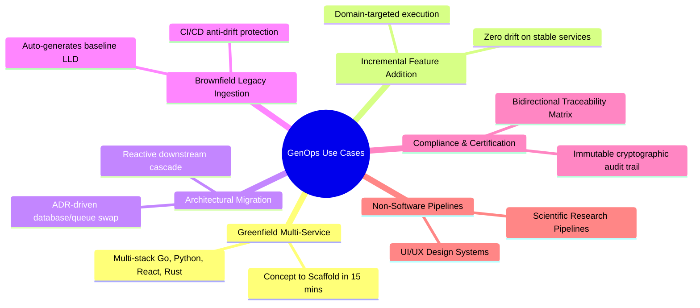
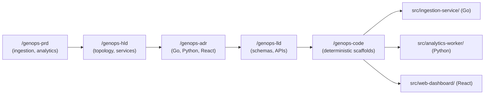
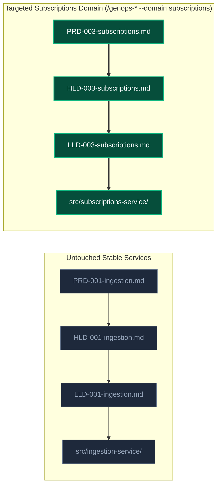
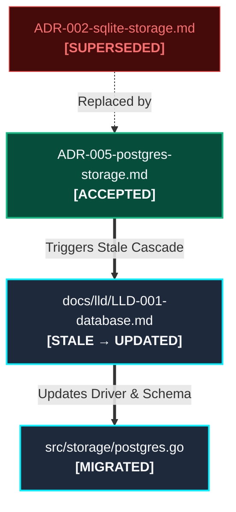
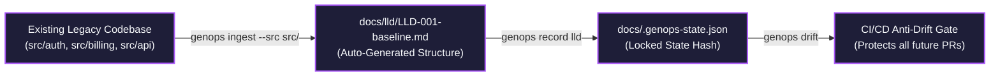
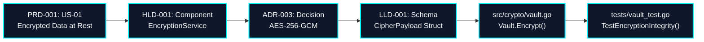
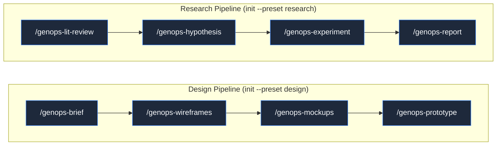

# GenOps: User Experience, Real-World Use Cases & Architectural Evolution Guide

**How development teams and AI coding agents build, maintain, modify, and upgrade complex software systems step by step.**

---

## 1. Executive Philosophy: Simplicity First, Infinite Depth on Demand

GenOps is designed around a dual-track developer experience:



---

## 2. The 6 Core Real-World Use Cases



---

### Use Case 1: Greenfield Multi-Service Application
**Scenario:** A team wants to build a new high-throughput event processing platform with Go microservices, Python ML workers, and a React frontend.



**Workflow:**
1. **Initialize Project:**
   ```bash
   python .agents/scripts/genops.py init --preset software-spec
   ```
2. **Define Product Requirements:**
   User prompts `/genops-prd`. The agent interviews the user domain by domain (e.g. `ingestion`, `analytics`, `billing`), generating `PRD-001-ingestion.md`, `PRD-002-analytics.md`.
3. **Design Topology & Decisions:**
   User prompts `/genops-hld` and `/genops-adr`. The team documents why Go was chosen for ingestion and Python for ML.
4. **Define Low-Level Contracts & Project Structure:**
   User prompts `/genops-lld`. LLD defines entity schemas, API endpoints, and the `## Project Structure` table.
5. **Deterministic Scaffolding:**
   User prompts `/genops-code`. GenOps deterministically expands `go-service`, `python-fastapi`, and `react-vite` scaffolds into `src/` with entity stubs and `docker-compose.yml`.

---

### Use Case 2: Incremental Feature Addition (Targeted Domain Execution)
**Scenario:** 6 months later, the team needs to add a new `subscriptions` feature without touching or regenerating existing stable services.



**Workflow:**
1. **Create Domain PRD:**
   ```bash
   # User prompts the agent:
   /genops-prd --domain subscriptions
   ```
   Agent creates only `docs/prd/PRD-003-subscriptions.md`.
2. **Cascade Downstream Only for `subscriptions`:**
   ```bash
   /genops-hld --domain subscriptions
   /genops-lld --domain subscriptions
   /genops-code --domain subscriptions
   ```
3. **Verification:**
   Existing `docs/prd/PRD-001-ingestion.md` and `src/ingestion-service/` remain completely untouched. Only `src/subscriptions-service/` is generated.

---

### Use Case 3: Architectural Migration & Tech Swap (ADR-Driven Evolution)
**Scenario:** The platform grows from 10k to 5M events/day. The team must migrate from embedded SQLite to a distributed PostgreSQL cluster.



**Workflow:**
1. **Draft New ADR:**
   User creates `docs/architecture/ADR-005-postgres-storage.md` marking `ADR-002-sqlite-storage.md` as `Superseded`.
2. **Check Reactive Cascading:**
   ```bash
   python .agents/scripts/genops.py status
   ```
   *Output:*
   ```
   Stage   | State   | Upstream   | Downstream
   adr     | approved| consistent | consistent
   lld     | stale   | changed    | at-risk
   code    | stale   | changed    | at-risk
   ```
3. **Apply Targeted Upgrade:**
   User prompts: *"Update LLD and database store stubs for Postgres migration"*.
   Agent loads `ADR-005` and updates `LLD-001` schemas and SQL drivers.
4. **Re-Record Approved State:**
   ```bash
   python .agents/scripts/genops.py record lld --actor lead-architect
   ```

---

### Use Case 4: Brownfield Legacy Codebase Ingestion
**Scenario:** A company has an existing 50,000-line repository with 4 microservices in `src/` and zero documentation.



**Workflow:**
1. **Run Ingestion:**
   ```bash
   python .agents/scripts/genops.py ingest --src src/
   ```
2. **Auto-Generated Baseline:**
   GenOps analyzes the directory tree and generates `docs/lld/LLD-001-baseline.md`.
3. **Record Initial Baseline:**
   ```bash
   python .agents/scripts/genops.py record lld --actor tech-lead
   ```
4. **Managed Evolution:**
   Any future modifications to `src/` are now protected by the CI anti-drift gate:
   ```bash
   python .agents/scripts/genops.py drift
   ```

---

### Use Case 5: Regulated Audit & Compliance Certification (FDA / SOC2 / ISO 26262)
**Scenario:** Compliance officers need proof that every safety requirement in PRD is implemented and tested in code.



**Workflow:**
1. **Generate Bidirectional RTM:**
   ```bash
   python .agents/scripts/genops.py rtm
   ```
   Outputs complete coverage table: `PRD User Story → HLD Component → ADR → LLD Entity → Code File`.
2. **Generate Executive HTML Audit Dashboard:**
   ```bash
   python .agents/scripts/genops.py report --html docs/audit-report.html
   ```
3. **Deliver Audit Artifacts:**
   Export `docs/audit-report.html` and `docs/.genops-events.jsonl` (cryptographically hashed, timestamped event trail).

---

### Use Case 6: Non-Software Multi-Domain Pipelines
**Scenario:** A UX research team or Academic science group wants structured, cascading specification without code.



---

## 3. Quick Reference: The Essential Commands

| Command | Everyday Usage | Advanced / Upgrade Usage |
|---|---|---|
| `python .agents/scripts/genops.py validate` | Verify project setup is healthy | Check custom scaffold or schema syntax |
| `python .agents/scripts/genops.py status` | Check which stage to run next | Detect exactly which downstream docs are stale |
| `python .agents/scripts/genops.py context --domain <slug>` | Load prompt context for single feature | 80% token reduction in large monorepos |
| `python .agents/scripts/genops.py drift` | Pre-commit sanity check | Automated PR gate in CI/CD pipeline |
| `python .agents/scripts/genops.py rtm` | Trace requirements coverage | SOC2 / ISO compliance audit export |
| `python .agents/scripts/genops.py report` | View visual dashboard | Export static HTML report for stakeholders |
