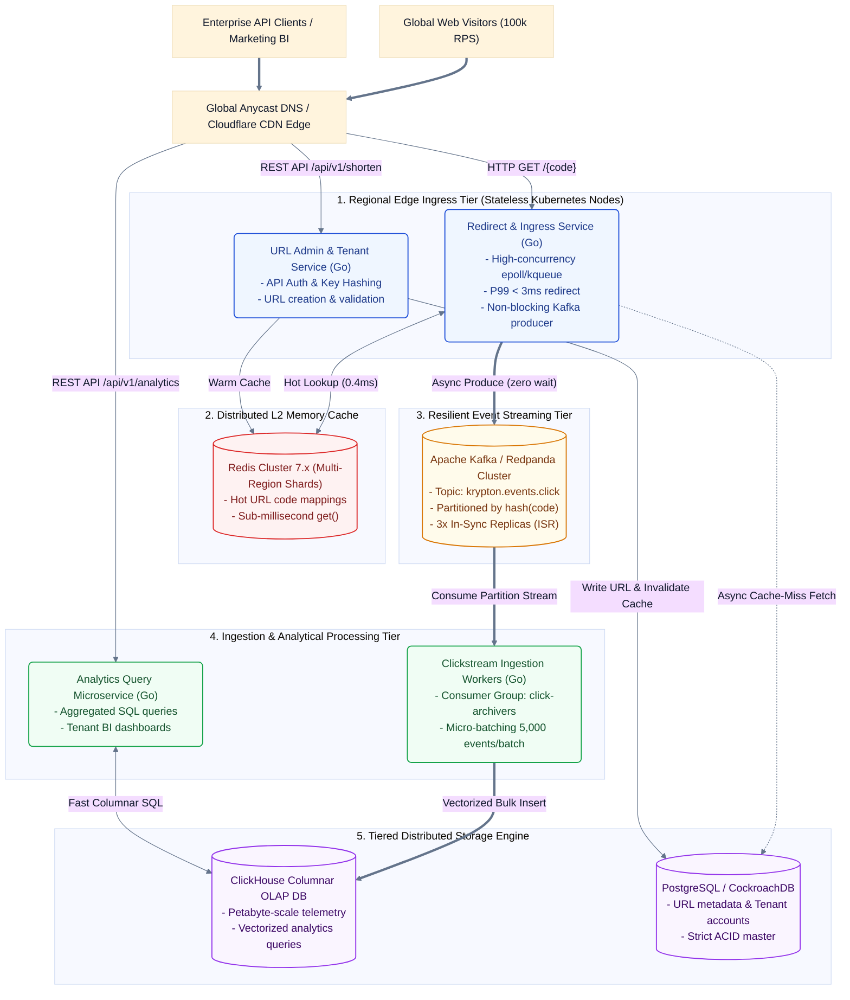
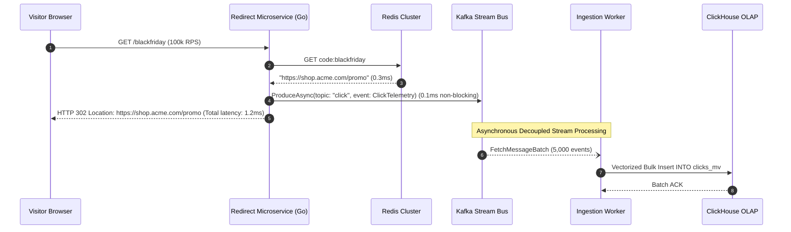

# HLD-001: Krypton Enterprise Clustered Microservices Architecture

## 1. Clustered System Topology & C4 Container Architecture

## 2. Dynamic End-to-End Clustered Sequence Flows

### A. Sub-3ms High-Throughput Redirection & Zero-Wait Streaming

## 3. Clustered Failure Domain & Partition Resiliency Matrix
| Subsystem Failure | Failure Impact | Automatic Fault Mitigation | RTO / RPO |
|---|---|---|---|
| **Redis Cache Node Crash** | Cache miss surge | Fallback to read-replica PostgreSQL with exponential jittered backoff; automatic Redis Sentinel/Cluster failover. | RTO < 2s, RPO = 0 |
| **Kafka Broker Partition Outage** | Click events buffered in memory | Ingress Go workers buffer locally up to 250MB per node in ring buffer; flushes to alternative broker. | RTO < 5s, RPO = 0 |
| **ClickHouse Cluster Maintenance** | Telemetry writes paused | Kafka retains 7 days of event history; ingestion workers pause and resume smoothly without dropping events. | RTO = N/A, RPO = 0 |

## 4. Adversarial Red-Team Stress-Test & Threat Mitigations
1. **DDoS Click Amplification & Traffic Spikes:**
   - *Attack Scenario:* 500,000 requests/sec syn-flood aimed at exhausting HTTP socket descriptors.
   - *Mitigation:* Anycast BGP network shedding at Cloudflare edge + Linux `epoll` / Go netpoll worker pool with bounded concurrency tokens.
2. **Kafka Hot-Partition Skew:**
   - *Attack Scenario:* Viral link receives 95% of traffic, saturating a single Kafka partition.
   - *Mitigation:* Dual-key hashing algorithm (`hash(code) + round_robin_salt(1..16)`) spreads load evenly across 64 Kafka topic partitions.
3. **Cross-Region Replication Lag:**
   - *Attack Scenario:* URL created in `us-east-1` accessed immediately in `eu-west-1` before DB sync.
   - *Mitigation:* Short-code creation publishes synchronously to global Redis replication channel, pre-warming all POPs within 50ms.

## 5. Technology Decisions Backlog (Needs ADR)
1. **ADR-001: Distributed Storage & Tiered Database Stack** — ClickHouse + PostgreSQL vs. DynamoDB vs. Cassandra.
2. **ADR-002: Event Streaming Engine** — Apache Kafka / Redpanda vs. NATS JetStream vs. AWS Kinesis.
3. **ADR-003: Microservices Language Runtime** — Go (Golang) vs. Rust vs. Java/JVM for high-concurrency redirect nodes.
