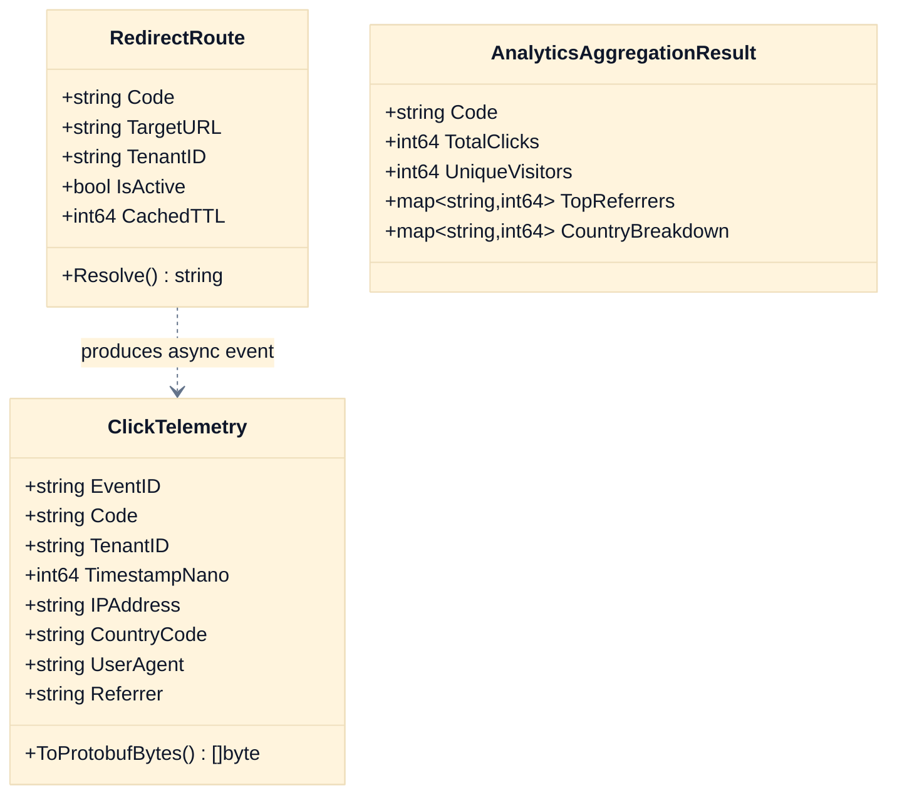

# LLD-001: Krypton Enterprise Clustered Microservices Low-Level Design

## 1. Domain-Driven Design (DDD) Aggregates & Boundaries



---

## 2. Distributed Database Schema & DDL (ClickHouse + PostgreSQL)

```sql
-- ClickHouse Columnar DDL for Petabyte-Scale Clickstream
CREATE DATABASE IF NOT EXISTS krypton_analytics;

CREATE TABLE IF NOT EXISTS krypton_analytics.clicks_raw (
    event_id UUID,
    code LowCardinality(String),
    tenant_id LowCardinality(String),
    timestamp DateTime64(3, 'UTC'),
    ip_address String,
    country_code LowCardinality(FixedString(2)),
    user_agent String,
    referrer String
) ENGINE = MergeTree()
PARTITION BY toYYYYMM(timestamp)
PRIMARY KEY (tenant_id, code, timestamp)
ORDER BY (tenant_id, code, timestamp, event_id)
SETTINGS index_granularity = 8192;
```

---

## 3. Microservice Interfaces & Ports (Go Clean Architecture)

```go
// Primary Port: Ingress Redirection Handler
type IRedirectService interface {
    ResolveRedirect(ctx context.Context, code string, meta IngressMetadata) (string, error)
}

// Secondary Port: Distributed L2 Cache
type IRedisCachePort interface {
    Get(ctx context.Context, code string) (string, error)
    Set(ctx context.Context, code string, targetURL string, ttl time.Duration) error
}

// Secondary Port: Asynchronous Message Streamer
type IKafkaProducerPort interface {
    ProduceClickEvent(ctx context.Context, event ClickTelemetry) error
}

// Secondary Port: Columnar OLAP Analytics Repository
type IClickHouseAnalyticsPort interface {
    RecordBatch(ctx context.Context, events []ClickTelemetry) error
    QueryMetrics(ctx context.Context, code string, timeRange TimeRange) (*AnalyticsAggregationResult, error)
}
```

---

## 4. Scaffolding Modules Blueprint

### Modules
| Module | Scaffold | Entities | Description |
|---|---|---|---|
| redirect-service | go-service | RedirectRoute, ClickTelemetry | High-concurrency Go redirection ingress gateway with Redis cluster and Kafka streaming |
| analytics-service | go-service | AnalyticsAggregationResult, MetricQuery | Analytical query service executing vectorized aggregations over ClickHouse OLAP |
