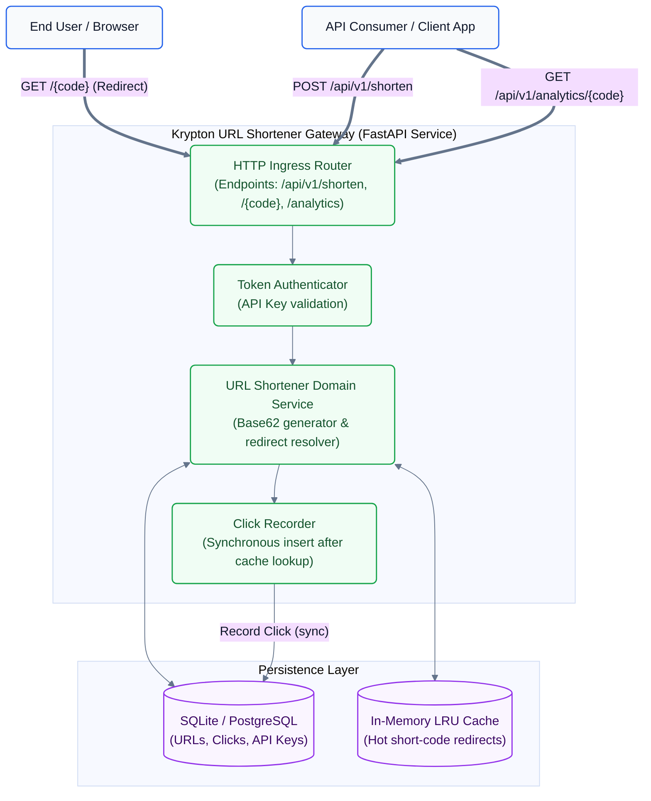
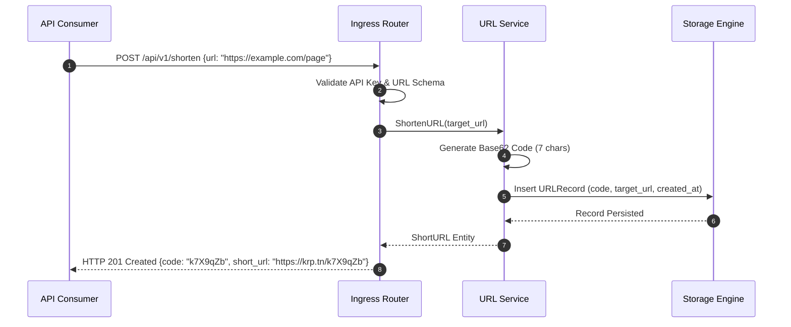
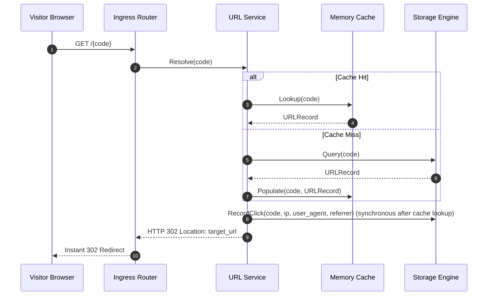

# HLD-001: High-Level System Architecture & Topology

## 1. System Topology & C4 Container Architecture

## 2. Dynamic Sequence Flows

### A. URL Shortening Flow (Synchronous)

### B. High-Throughput Redirection with Synchronous Click Recording

## 3. Failure Domain & Resilience Matrix
| Subsystem Failure | Impact | Mitigation Strategy | Recovery Time Objective (RTO) |
|---|---|---|---|
| **Database Read Latency Spike** | Redirection slowdown | In-memory LRU cache serves hot links directly without DB touch | RTO = 0s (Graceful fallback) |
| **Click Event Buffer Saturation** | Memory pressure under DDoS | Fixed-size bounded queue with drop-oldest policy; analytics degrades before redirect ingress | RTO < 5s |
| **Invalid Target Hostname** | Consumer error | Strict validation against RFC 3986 with DNS pre-check before persistence | Instant 400 Bad Request |

## 4. Adversarial Red-Team Stress-Test & Vulnerability Assessment
1. **Concurrency Race / Short Code Collision:**
   - *Attack Scenario:* 100 concurrent requests trigger identical hash offsets.
   - *Mitigation:* Cryptographic Murmur3/SHA-256 + nano-timestamp salt with unique database index constraint on `code`. Automatic retry with alternative salt on collision.
2. **Click Event Flooding / DDoS Amplification:**
   - *Attack Scenario:* Botnet generates 50,000 GET requests/sec on short code to saturate database writes.
   - *Mitigation:* Background click dispatcher decouples HTTP worker thread from database write; click ingestion uses batched bulk transactions every 100ms or 500 events.
3. **Internal Network Scanning via Redirects (SSRF):**
   - *Attack Scenario:* Attacker creates short URL to `http://169.254.169.254/latest/meta-data/` or internal admin ports.
   - *Mitigation:* Target URL validator parses hostname and resolves IP; loopback (`127.0.0.0/8`), link-local (`169.254.0.0/16`), and private CIDRs (`10.0.0.0/8`, `172.16.0.0/12`, `192.168.0.0/16`) are strictly rejected.

## 5. Technology Decisions Backlog (Needs ADR)
1. **ADR-001: Storage Engine Selection** — Embedded SQLite with WAL mode vs. External PostgreSQL for single-node vs. distributed deployment.
2. **ADR-002: Short-Code Generation Algorithm** — Base62 Counter vs. Cryptographic Hash Truncation vs. UUIDv7.
