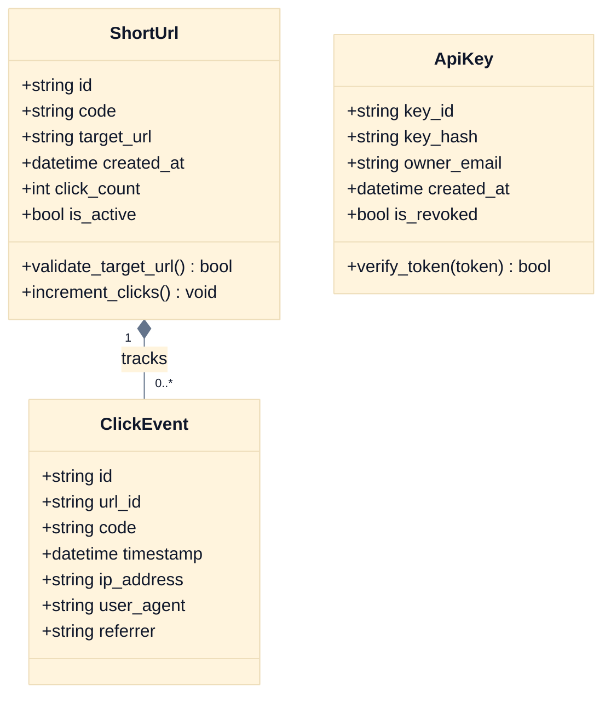

# LLD-001: Low-Level System Design & Contract Specifications

## 1. Domain-Driven Design (DDD) Aggregates & Invariants



### Domain Invariants:
1. `ShortUrl.code`: Must be 3–30 characters matching `^[a-zA-Z0-9_-]{3,30}$`.
2. `ShortUrl.target_url`: Must be a valid absolute URI with `http` or `https` scheme; cannot point to loopback/private CIDR ranges.
3. `ClickEvent.timestamp`: Immutable UTC timestamp assigned upon receipt.

---

## 2. Database Schema & DDL Migrations (SQLite / PostgreSQL)

```sql
-- Migration: 000001_create_url_shortener_tables.sql
PRAGMA journal_mode = WAL;
PRAGMA foreign_keys = ON;

CREATE TABLE IF NOT EXISTS urls (
    id TEXT PRIMARY KEY,
    code TEXT UNIQUE NOT NULL,
    target_url TEXT NOT NULL,
    created_at TIMESTAMP DEFAULT CURRENT_TIMESTAMP NOT NULL,
    click_count INTEGER DEFAULT 0 NOT NULL,
    is_active INTEGER DEFAULT 1 NOT NULL
);

CREATE INDEX IF NOT EXISTS idx_urls_code ON urls(code);
CREATE INDEX IF NOT EXISTS idx_urls_created_at ON urls(created_at);

CREATE TABLE IF NOT EXISTS clicks (
    id TEXT PRIMARY KEY,
    url_id TEXT NOT NULL,
    code TEXT NOT NULL,
    timestamp TIMESTAMP DEFAULT CURRENT_TIMESTAMP NOT NULL,
    ip_address TEXT,
    user_agent TEXT,
    referrer TEXT,
    FOREIGN KEY (url_id) REFERENCES urls(id) ON DELETE CASCADE
);

CREATE INDEX IF NOT EXISTS idx_clicks_code ON clicks(code);
CREATE INDEX IF NOT EXISTS idx_clicks_timestamp ON clicks(timestamp);

CREATE TABLE IF NOT EXISTS api_keys (
    key_id TEXT PRIMARY KEY,
    key_hash TEXT NOT NULL,
    owner_email TEXT NOT NULL,
    created_at TIMESTAMP DEFAULT CURRENT_TIMESTAMP NOT NULL,
    is_revoked INTEGER DEFAULT 0 NOT NULL
);
```

---

## 3. OpenAPI 3.1 API Contracts

```yaml
openapi: 3.1.0
info:
  title: Krypton URL Shortener Gateway API
  version: 1.0.0
paths:
  /api/v1/shorten:
    post:
      summary: Create a shortened URL
      security:
        - ApiKeyAuth: []
      requestBody:
        required: true
        content:
          application/json:
            schema:
              type: object
              required: [url]
              properties:
                url:
                  type: string
                  format: uri
                  example: "https://example.com/deep/page"
                custom_alias:
                  type: string
                  pattern: "^[a-zA-Z0-9_-]{3,30}$"
                  example: "my-promo"
      responses:
        "201":
          description: Short URL created successfully
          content:
            application/json:
              schema:
                type: object
                properties:
                  code: { type: string }
                  short_url: { type: string }
                  target_url: { type: string }
                  created_at: { type: string, format: date-time }
        "400":
          description: Invalid URL schema or private IP target
        "409":
          description: Custom alias collision

  /{code}:
    get:
      summary: Redirect to target URL
      parameters:
        - name: code
          in: path
          required: true
          schema: { type: string }
      responses:
        "302":
          description: Redirection to target location
          headers:
            Location: { schema: { type: string } }
        "404":
          description: Short code not found or inactive

  /api/v1/analytics/{code}:
    get:
      summary: Retrieve clickstream analytics for short code
      security:
        - ApiKeyAuth: []
      parameters:
        - name: code
          in: path
          required: true
          schema: { type: string }
      responses:
        "200":
          description: Analytics summary
          content:
            application/json:
              schema:
                type: object
                properties:
                  code: { type: string }
                  total_clicks: { type: integer }
                  target_url: { type: string }
                  created_at: { type: string, format: date-time }
                  recent_referrers:
                    type: array
                    items: { type: string }
```

---

## 4. Project Structure & Scaffolding Blueprint

### Modules
| Module | Scaffold | Entities | Description |
|---|---|---|---|
| url-shortener | python-fastapi | ShortUrl, ClickEvent, ApiKey | Core URL shortening and analytics microservice |
